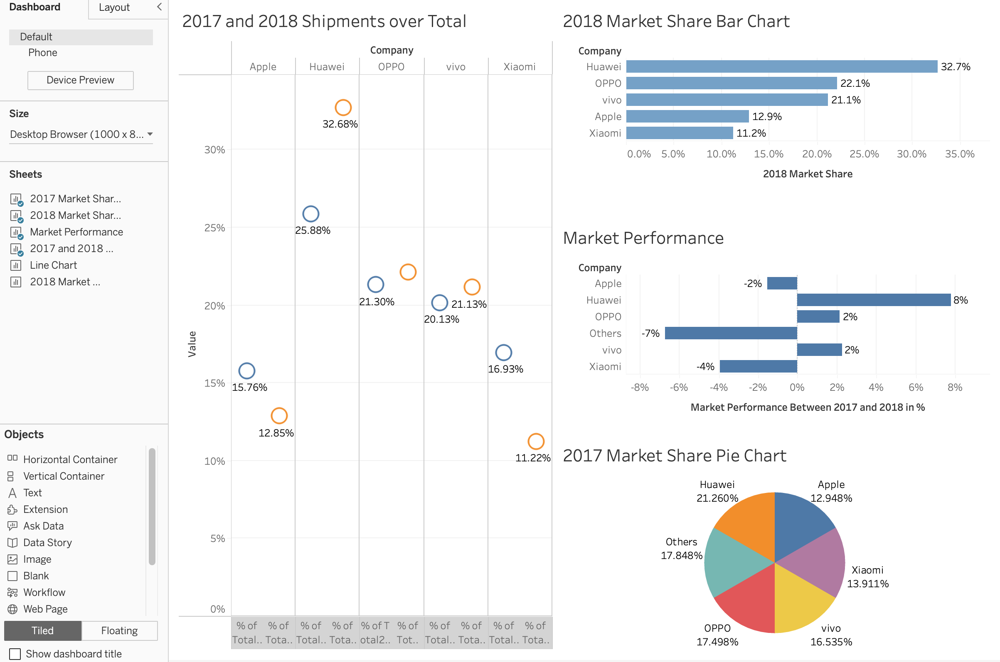

# Cellphone-Sales-Shipments-Analysis-Market-Trends-and-Competitive-Performance


# Mixed Units and Sales Data - Data Visualization (MIS 505) Project

## Overview
This Tableau project demonstrates effective table design for analyzing and visualizing sales data from several major cellphone brands. The workbook uses real-world examples to illustrate how different table formats can improve data lookup, comparison, and overall readability. The dataset represents cellphone sales across different time periods and includes important metrics such as shipment units and market share. This project is part of the MIS 505 Data Visualization course.

## Project Purpose
The primary objectives of this project are to:
- **Showcase Data Organization:**  
  Learn how to structure raw sales data into clear, well-designed tables.
- **Facilitate Comparison:**  
  Enable direct comparisons between different cellphone brands by presenting quantitative figures alongside categorical identifiers.
- **Enhance Readability:**  
  Demonstrate the impact of unidirectional (vertical or horizontal) and bidirectional table layouts on data comprehension.
- **Support Data-Driven Decisions:**  
  Provide insights into brand performance by highlighting trends, market share percentages, and shipment differences over time.

## Data Details
The dataset focuses on cellphone sales and includes the following key aspects:
- **Brands Covered:**  
  - Huawei  
  - OPPO  
  - vivo  
  - Apple  
  - Xiaomi  
  - Others
  
- **Metrics and Comparisons:**  
  - **Sales (Shipment Data):**  
    Shipment figures are provided for two different time periods (e.g., 4Q17 and 4Q18), allowing for trend analysis and growth assessment.
  - **Market Share:**  
    Data includes both the percentage market share and the absolute shipment units, offering a comprehensive view of each brand’s performance.
  - **Mixed Units:**  
    The tables illustrate how to present data involving both numerical figures and percentages side by side, addressing the challenge of displaying mixed units effectively.

## Practical Examples Provided
### Shipment Data
- **Purpose:**  
  Compare quarterly shipment figures of cellphone brands to identify growth trends or declines.
- **Details:**  
  Shipment data is provided for each cellphone brand (Huawei, OPPO, vivo, Apple, Xiaomi, and Others) with separate figures for each period. This allows for:
  - Evaluating shifts in market share.
  - Assessing individual brand performance over time.

### Market Share Comparisons
- **Purpose:**  
  Understand how each brand contributes to the overall market.
- **Details:**  
  The data presents market share both in percentage form and as absolute numbers (units shipped), which can be examined through different table arrangements to highlight variations and trends.

### Table Formats
- **Unidirectional Tables:**  
  Tables formatted to be read in one direction (either vertically or horizontally), simplifying data lookup.
- **Bidirectional Tables:**  
  Tables designed to be read both down and across, supporting more dynamic comparisons across multiple dimensions.

## Results and Analysis
The visualizations and table designs in this project reveal several key insights based on the sales data for the cellphone brands:

### Key Observations
1. **2017 vs. 2018 Shipments:**  
   - **Growth Trends:**  
     - **Huawei, OPPO, and vivo** exhibit noticeable growth from 2017 to 2018, with Huawei leading in shipment increases.
     - **Apple, Xiaomi, and Others** show a decline, indicating these brands lost ground in terms of shipment numbers.
   - **Market Consolidation:**  
     The data suggests a market shift where fewer brands (Huawei, OPPO, and vivo) capture a larger share of overall shipments.

2. **Market Share Comparisons (2018):**  
   - **Dominance of Huawei:**  
     Huawei features the largest market share in 2018, clearly distancing itself from competitors.
   - **Gaining Momentum:**  
     OPPO and vivo also gain market share, whereas Apple, Xiaomi, and the “Others” category lag behind.
   
3. **Visual Performance Indicators:**  
   - **Bar Charts and Pie Charts:**  
     A bar chart displaying the 2018 market share emphasizes Huawei’s leadership, while a 2017 pie chart reflects a more balanced market that has since shifted significantly.
   - **Growth vs. Decline:**  
     Additional charts highlight positive growth for brands like Huawei, OPPO, and vivo, countered by declines for Apple, Xiaomi, and Others.

### Implications for Decision-Making
- **Competitive Landscape:**  
  The data indicates a consolidation around a few key players, which can guide strategies in marketing, product development, and positioning.
- **Actionable Insights:**  
  Recognizing which brands are growing and which are declining enables targeted analysis and more effective resource allocation.

### Including the Screenshot
To provide a visual reference, include the following Markdown snippet in your README file (ensure that the screenshot is in your repository):





## How to Use the Project
1. **Opening the Tableau Workbook:**  
   - Open the `Mixed Units and Sales Data.twb` file in Tableau Desktop.
   - Navigate through multiple dashboards that display different table designs and data views.

2. **Exploring Visualizations:**  
   - Interact with the dashboards to switch between unidirectional and bidirectional table layouts.
   - Utilize filters and drill-down options to explore detailed shipment and market share data across the cellphone brands.

3. **Learning Outcomes:**  
   - Understand how to translate raw cellphone sales data into meaningful insights.
   - Appreciate how table design can clarify complex data relationships.
   - Gain practical experience in using Tableau to enhance data-driven decision-making.

## Conclusion
This project serves as a comprehensive guide to using table designs for presenting cellphone sales data effectively. By focusing on real-world sales metrics from brands such as Huawei, OPPO, vivo, Apple, Xiaomi, and Others, the workbook demonstrates how to create dynamic, readable tables that highlight key trends and drive strategic insights. Whether you are a data analyst, business user, or Tableau enthusiast, this project will help you better organize and communicate sales data for actionable insights.
```
